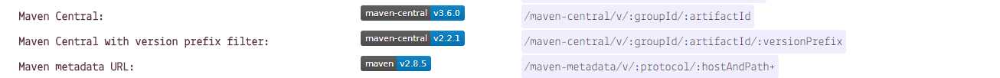

# 《TypeScript学起来》

> 本文档模板是本着```开箱即用```的思想做的,为某些刚上手使用```docsify```但又不清楚如何制作`属于自己的文档`的小伙伴提供的一个模板,以下只是提供了一个常用的配置设置，更多自定义请参考[官方文档](https://docsify.js.org/#/zh-cn/)

## 快速导航

- [肩徽制作](#肩徽制作)


# 肩徽制作
> 很多小伙伴可能还不知道如何制作属于自己的肩徽，在这里就一并奉上肩徽制作的方法

## 动态肩徽制作
- 首先,进入[**shields.io**](https://shields.io/)选择自己需要的肩徽类型
- 这里我们用`Version`标签做一下示例
	- 在平常的时候我们经常会见到在Github中Java类项目有如下的肩徽

	

	这样的肩徽标识者当前项目发布在`MavenCenterl`的最新版本号
	- 首先我们先进入`Version`便签，按下`Ctrl+F`打开浏览器搜索框，输入`maven`,我们将会看到有关`Maven`的三个肩徽

	
	- 我们点击`Maven Central`进入制作页面,在groupid和artifactid处输入我们发布到`mavenCentral`的组件,稍后页面会自动搜索查找,在下方实时显示版本肩徽,此时我们只需点击`Copy Badge Url`获取肩徽的url地址,在需要使用的地方使用如下语法即可使用：
	``````

## 静态肩徽制作
- 在[**shields.io**](https://shields.io/)页面中找到`Static`的标签
- 在label处输入肩徽的前半段文字,在message处输入肩徽的后半段文字,选择一个自己喜欢的颜色
	> 在下方有颜色的预览
- 最后点击`Make Badge`跳转到预览界,复制浏览器地址栏中的地址即可使用

